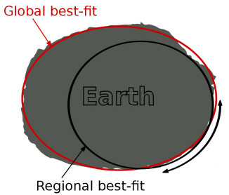
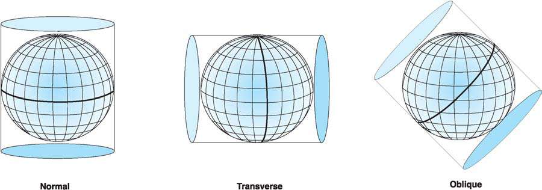
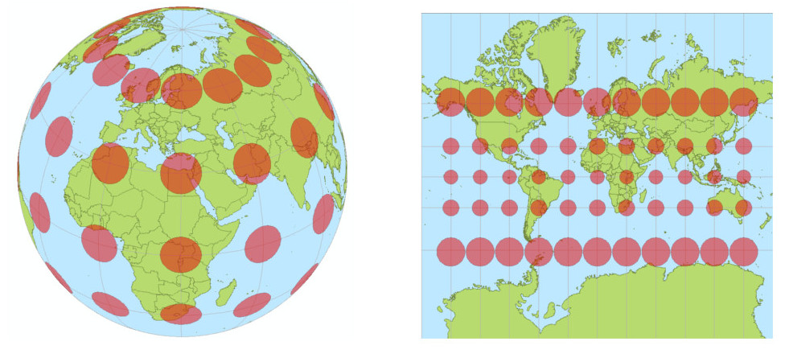
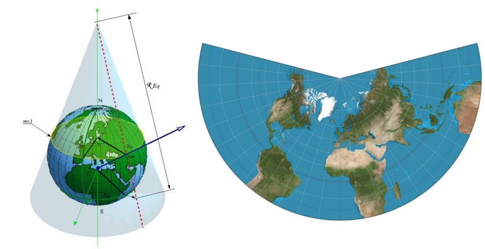

# Numerical Weather Prediction (NWP)

Raziel &amp; tecer

---

# Part 1

## Preparing the software

---

*Strongly recommended:*

Use the Vagrantbox provided at https://vagrantcloud.com/tecer/wrftut
as it contains all the required software and data sets (custom HDF and netCDF already pre-compiled).

---

## Compiling WRF

The compilation of WRF takes some time.

`> cd /home/vagrant`

`> tar -xf packages/WRF-4.1.3.tar.gz ; cd WRF-4.1.3`

`> export NETCDF=/usr/local`

`> ./configure`

In the following dialogue, select GNU / dmpar (34) (requires OpenMPI, alternatively, you can select GNU / serial (32), but then the only 1 core will be used for the actual computation)

`> ./compile -j 1 em_real >& compile.log` (for some reason, the OpenMPI version does not like to be compiled in parallel, hence the `-j1` option)
Sit back and enjoy the interlude...

---

# Interlude 1

## Map projections

---

## World model

---

## Cylindrical

---

## Mercator

---

## Polar stereographic

---

## Lambert

---

## Map projection recommendations

- Lambert: mid latitudes
- Mercator: low latitudes
- Polar-stereographic: high latitudes
- Lon-Lat: global
- Generally: minimize the distortion!
- Conformity: Locally, angles are preserved
- Areas are *not* preserved

---

# Back to the preparation...

---

## Compiling WPS

WPS is the WRF preprocessing system.

`> cd /home/vagrant`

`> tar -xf packages/WPS-4.1.tar.gz ; cd WPS-4.1`

`> export NETCDF=/usr/local`

`> export WRF_DIR=/home/vagrant/WRF-4.1.3`

`> ./configure`

In the dialogue, select Linux / gfortran / serial (OpenMPI does not improve anything here).

`> ./compile >& compile.log`

---

## Compiling UPP

UPP is the only actually working and usable post-processing system.

`> cd /home/vagrant`

`> tar -xf packages/DTC_upp_v4.0.1.tar.gz ; cd UPPV4.0.1`

`> export WRF_DIR=/home/vagrant/WRF-4.1.3`

`> export JASPERLIB=/usr/lib`

`> export JASPERINC=/usr/include`

`> ./configure`

In the dialogue, select Linux / gfortran / serial (dmpar won't work - and doesn't improve much anyway!)

`> ./compile >& compile.log`

---

Now, the software is set up. Next...

# Part 2

## Preprocessing

---

## WPS

WPS is the pre-processing package for WRF.

Main settings:

- timespan
- area of interest (map projection + extents)

It prepares

- static data
- initial data

by extracting the relevant parts and interpolating the data to the area of interest (horizontally).

---

## WPS configuration

Configuration file: `WPS/namelist.wps`

Important settings:

- `start_date` and `end_date`: forecast time span
- `interval_seconds`: output time step duration
- `e_sn`, `e_we`: number of grid cells south-north/west-east
- `geog_data_res`: resolution of static data
- `dx`, `dy`: grid cell dimension in map units (f.e. meters)
- `map_proj`: map projection ("lambert", "mercator", "polar", "lat-lon")

Projection parameters:
- `ref_lat`, `ref_lon`: grid center
- `true_lat{1,2}`, `stand_lon`: Lambert-parameters
- `geog_data_path`: absolute path to the static data (`/home/wrf/data/WPS_GEOG`)

---

## Pre-processing static data

Static data := Digital elevation model (DEM), land-use, land-sea-mask, (SST),...

`> cd /home/vagrant`

`> mkdir data ; cd data`

`> tar -xf ../packages/geog_low_res_mandatory.tar.gz`

`> cd /home/vagrant/WPS-4.1`

`> cp ../packages/namelist.wps .`

`> ./geogrid.exe`

Result: `geo_em` file(s) containing static data horizontally interpolated to AOI.

---

## Initial data

Several sources, here: GFS (NOAA/NCEP global model), 4 runs per day.
Temporal resolution: hourly forecast up to 120 hours, 3-hourly 120-240 hours, 12-hourly to 384 hours
Spatial resolution: 0.5 degrees or 0.25 degrees (lon-lat)

Download (freely available) from

`http://www.ftp.ncep.noaa.gov/data/nccf/com/gfs/prod/`

File format: Grib2, one file per time step, containing several hundred bands
(=many parameters at many levels)

---

## Pre-processing initial/BC data

`> cd /home/vagrant/data`

`> tar -xf ../packages/gfs.tar.bz2`

`> cd /home/vagrant/WPS-4.1`

`> ./link_grib.csh /home/vagrant/data/gfs/gfs.2019121900/gfs.t00z.pgrb2.1p00.f0*`

`> ln -sf ungrib/Variable_Tables/Vtable.GFS Vtable`

`> ./ungrib.exe`

`> ./metgrid.exe`

Result: `met_em` file(s) containing all the static and
initial condition/boundary condition data for all time steps,
horizontally interpolated to the AOI.

---

# Part 3

## Model run (finally!)

---

## WRF

Main settings:

- timespan
- area of interest
- physics options

Initial condition is evolved using physical rules while respecting the boundary conditions.

---

## WRF configuration

Configuration file: `WRF-4.1.3/test/em_real/namelist.input`

Important settings:
Start and end dates, time interval and domain definition as in WPS configuration
`history_interval`: output data every N <b>minutes</b>
Settings for physics schemes

---

## Vertical interpolation

`> cd /home/vagrant/WRF-4.1.3/test/em_real`

`> cp /home/vagrant/packages/namelist.input .`

`> ln -sf ../../../WPS-4.1/met_em.* .`

`> ./real.exe`

Result: `wrfinput` and `wrfbdy` files.

Strictly speaking: another pre-processing step.

---

## WRF Model run

`> ./wrf.exe`

if WRF was compiled with OpenMPI support (strongly recommended), it can use multiple cores via 

`> mpirun -n 2 wrf.exe`

Sit back and have a drink...

---

# Interlude 2

---

# Post-processing

## UPP to the rescue!

---

## Running UPP

UPP is the unified Post Processing system, to my knowledge the only feasible way of producing usable output.

`> cd /home/vagrant/WRF-4.1.3/test/em_real`

`> mkdir postprd ; mkdir wrfprd ; mkdir parm`

`> cd wrfprd ; ln -s ../wrfout_d01_* .`

`> cd ../parm`

`> cp /home/vagrant/UPPV4.0.1/parm/postcntrl.xml .`

`> cp /home/vagrant/UPPV4.0.1/parm/postxconfig-NT-WRF.txt .`

`> cd /home/vagrant/UPPV4.0.1/scripts`

`> cp /home/vagrant/packages/run_unipost .`

`> ./run_unipost`

---

## Visualizations

Resulting grib2-files: 

`/home/vagrant/WRF-4.1.3/test/em_real/postprd/wrfprs_d01.00 .. 48`

Copy them to `/vagrant/output`:

`> mkdir /vagrant/output`

`> cp /home/vagrant/WRF-4.1.3/test/em_real/postprd/wrfprs_d01.* /vagrant/output/`
